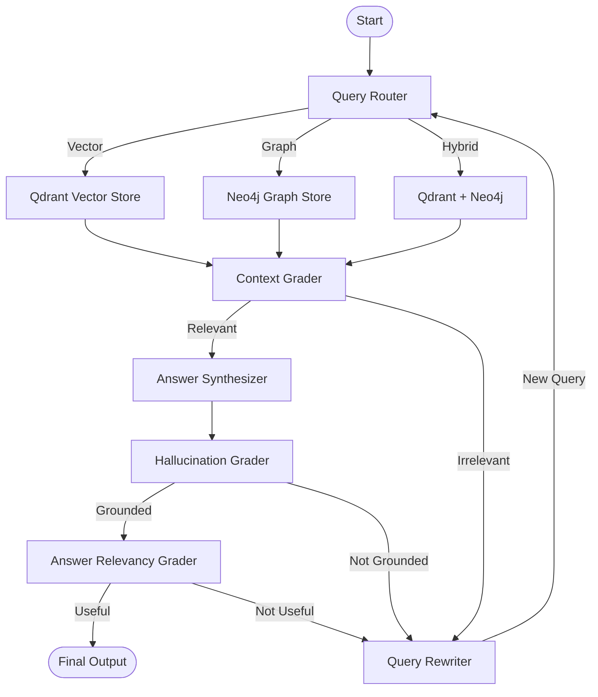

# Cognitive GraphRAG

A FastAPI service that combines **vector search** (Qdrant) with **knowledge graph retrieval** (Neo4j) inside a LangGraph workflow. Documents are chunked, embedded, and converted into entities/relationships, then the cognitive agent routes each query through retrieval grading, synthesis, hallucination checking, and answer-relevancy scoring.

## Prerequisites

- Python 3.10+
- Docker & Docker Compose
- An OpenAI API key

## Setup

1. Clone the repository and navigate into the project folder:

   ```bash
   cd project-1-cognitive-graphrag
   ```

2. Create and activate a Python virtual environment:

   ```bash
   python3 -m venv venv
   source venv/bin/activate  # On Windows: venv\Scripts\activate
   ```

3. Install the Python dependencies:

   ```bash
   pip install -r requirements.txt
   ```

4. Create a `.env` file from the example and add your OpenAI API key:

   ```bash
   cp .env.example .env
   ```

   Edit `.env` and set:

   ```env
   OPENAI_API_KEY=sk-...
   ```

## Start infrastructure

Qdrant and Neo4j are managed with Docker Compose:

```bash
docker-compose up -d
```

- Qdrant dashboard: http://localhost:6333/dashboard
- Neo4j Browser: http://localhost:7474 (user: `neo4j`, password: `password123`)

## Start the API

```bash
uvicorn app.main:app --reload
```

The API will be available at http://localhost:8000.
Interactive docs: http://localhost:8000/docs

## Architecture

The LangGraph cognitive pipeline routes queries through retrieval, grading, synthesis, and self-correction. The router selects the retrieval strategy; the context grader decides if retrieved context is relevant; the synthesizer produces an answer; and the hallucination and answer-relevancy graders decide whether to return the answer or rewrite the query. A maximum of 3 rewrite loops is enforced.



## API usage examples

### Index a document

```bash
curl -X POST "http://localhost:8000/index" \
  -H "Content-Type: application/json" \
  -d '{
    "title": "Quantum Research Lab",
    "content": "Dr. Aris Thorne leads the Quantum Materials Division. The division develops superconducting qubits and integrates with the cryogenics team.",
    "source": "manual"
  }'
```

Expected response:

```json
{
  "status": "success",
  "title": "Quantum Research Lab",
  "source": "manual",
  "chunks_processed": 1
}
```

### Query the index

```bash
curl -X POST "http://localhost:8000/query" \
  -H "Content-Type: application/json" \
  -d '{
    "query": "Who leads the Quantum Materials Division?"
  }'
```

Expected response fields:

```json
{
  "query": "Who leads the Quantum Materials Division?",
  "refined_query": "...",
  "extracted_entities": [...],
  "route": "vector|graph|hybrid",
  "retrieval_score": 0.9,
  "hallucination_score": 0.1,
  "answer_score": 0.95,
  "response": "Dr. Aris Thorne leads the Quantum Materials Division."
}
```

## Environment variables

| Variable            | Description                                               | Example value                         |
|---------------------|-----------------------------------------------------------|---------------------------------------|
| `OPENAI_API_KEY`    | OpenAI API key used for embeddings, extraction, and LLM calls. | `sk-...`                              |
| `OPENAI_MODEL_NAME` | OpenAI chat model used for reasoning and synthesis.       | `gpt-4o-mini`                         |
| `EMBEDDING_MODEL_NAME` | OpenAI embedding model used for Qdrant vectors.        | `text-embedding-3-small`              |
| `NEO4J_URI`         | Bolt URI for the Neo4j instance.                          | `bolt://localhost:7687`               |
| `NEO4J_USERNAME`    | Neo4j username.                                           | `neo4j`                               |
| `NEO4J_PASSWORD`    | Neo4j password.                                           | `password123`                         |
| `QDRANT_HOST`       | Hostname for the Qdrant server.                           | `localhost`                           |
| `QDRANT_PORT`       | gRPC/REST port for the Qdrant server.                     | `6333`                                |
| `QDRANT_COLLECTION` | Name of the Qdrant collection for document chunks.        | `cognitive_graphrag_chunks`           |

## Hugging Face Space Deployment

The FastAPI app can also be deployed as a public, Docker-based Hugging Face Space. This lets others interact with the Cognitive GraphRAG API without running anything locally.

### 1. Create the Space

1. Go to [huggingface.co/spaces](https://huggingface.co/spaces) and click **Create new Space**.
2. Choose a name such as `cognitive-graph-rag`.
3. Select **Docker** as the Space SDK.
4. Set the visibility to **Public** (or Private if you prefer).
5. Click **Create Space**.

### 2. Configure secrets

In the Space settings, add the following secrets under **Variables and secrets**:

| Variable            | Description                                         |
|---------------------|-----------------------------------------------------|
| `OPENAI_API_KEY`    | Your OpenAI API key.                                |
| `NEO4J_URI`         | Bolt URI for the Neo4j instance.                    |
| `NEO4J_USER`        | Neo4j username.                                     |
| `NEO4J_PASSWORD`    | Neo4j password.                                     |
| `QDRANT_URL`        | Qdrant server URL.                                  |
| `QDRANT_API_KEY`    | Qdrant API key (if required by your instance).      |

### 3. Push the code

Clone the empty Space repository and copy the project files into it, then push:

```bash
git clone https://huggingface.co/spaces/<your-username>/cognitive-graph-rag
cd cognitive-graph-rag
# Copy project files (Dockerfile, app/, requirements.txt, etc.) into this directory
git add .
git commit -m "Deploy Cognitive GraphRAG FastAPI app"
git push
```

Wait for the Space to build and start. Once the status indicator turns green, the API is live.

### 4. Live Space link

Replace `<your-username>` below with your Hugging Face username:

```text
https://huggingface.co/spaces/<your-username>/cognitive-graph-rag
```

### 5. API examples against the deployed Space

Use the live Space URL in place of `http://localhost:8000`. The examples below assume the Space is public:

#### Index a document

```bash
curl -X POST "https://<your-username>-cognitive-graph-rag.hf.space/index" \
  -H "Content-Type: application/json" \
  -d '{
    "title": "Quantum Research Lab",
    "content": "Dr. Aris Thorne leads the Quantum Materials Division. The division develops superconducting qubits and integrates with the cryogenics team.",
    "source": "manual"
  }'
```

#### Query the index

```bash
curl -X POST "https://<your-username>-cognitive-graph-rag.hf.space/query" \
  -H "Content-Type: application/json" \
  -d '{
    "query": "Who leads the Quantum Materials Division?"
  }'
```

## Testing

A pytest test suite will be added in Phase 3.
